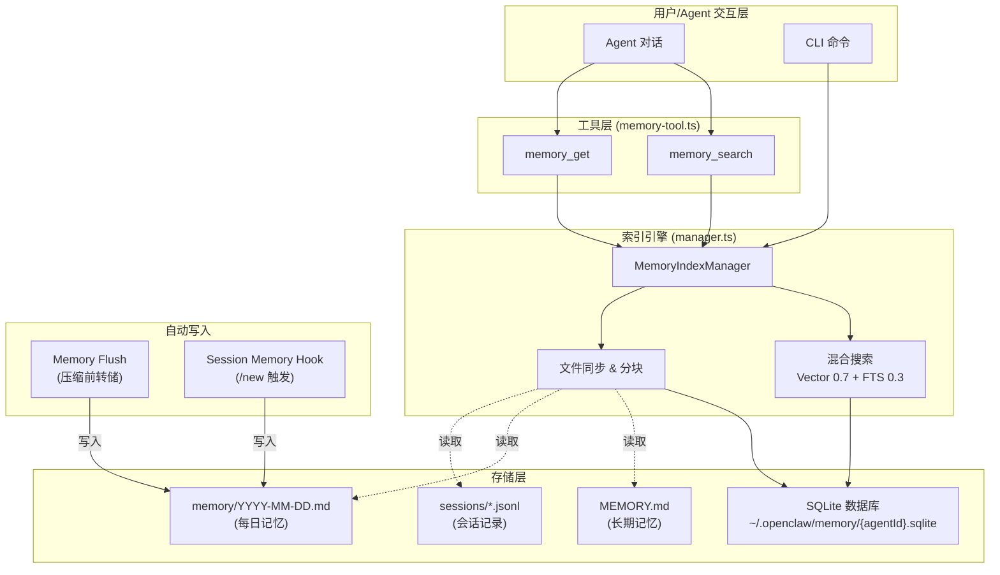
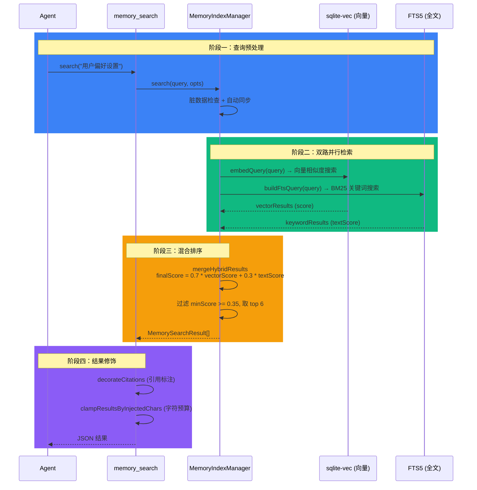
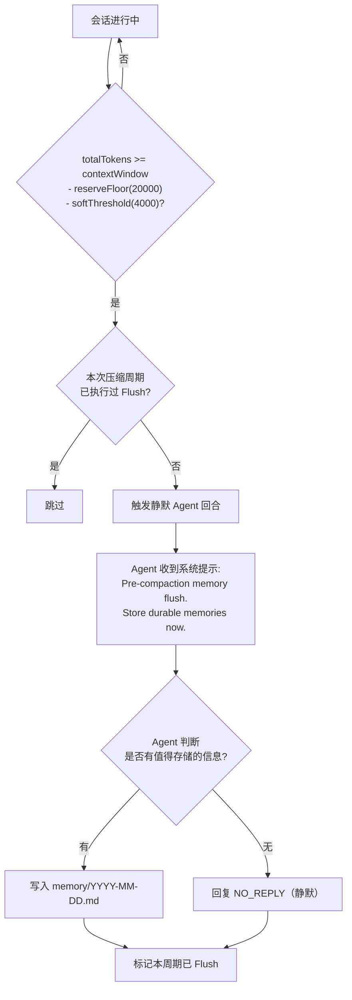

# OpenClaw 记忆机制深度解析

OpenClaw 拥有一套**多层级、生产级别**的记忆系统，核心目标是让 AI 智能体（Agent）能够**跨会话地记住**用户的偏好、决策、历史对话等关键信息。整个系统围绕"**文件即记忆**"的理念构建，使用 Markdown 文件作为持久化载体，通过向量 + 全文检索实现语义搜索。

---

## 一、整体架构总览

系统可划分为 **5 大模块**：

1. **记忆文件存储** -- 以 Markdown 文件为"记忆"的物理载体
2. **索引与搜索引擎** -- SQLite + 向量/FTS5 混合检索
3. **Agent 工具层** -- 暴露给 AI 智能体的 `memory_search` / `memory_get` 工具
4. **自动写入机制** -- 包括 Memory Flush（压缩前自动转储）和 Session Memory Hook
5. **CLI 管理命令** -- `openclaw memory status/index/search`



---

## 二、记忆文件存储

> 核心理念：**Markdown 文件就是记忆的唯一事实来源（Source of Truth）**。

### 2.1 文件类型与路径

| 文件 | 路径 | 用途 |
|------|------|------|
| **MEMORY.md** | `~/.openclaw/workspace/MEMORY.md` | 长期精选记忆（仅私聊加载） |
| **每日记忆** | `~/.openclaw/workspace/memory/YYYY-MM-DD.md` | 每天追加的流水记忆 |
| **会话记录** | `~/.openclaw/agents/{agentId}/sessions/*.jsonl` | JSON Lines 格式的对话历史 |

### 2.2 相关代码

- `src/memory/internal.ts:78-144` -- `listMemoryFiles()` 函数负责扫描 `MEMORY.md`、`memory.md`、`memory/` 目录以及额外路径下的所有 `.md` 文件
- `src/memory/internal.ts:46-55` -- `isMemoryPath()` 判断路径是否属于记忆文件

> 引用 `internal.ts`:
> ```typescript
> export function isMemoryPath(relPath: string): boolean {
>   const normalized = normalizeRelPath(relPath);
>   if (normalized === "MEMORY.md" || normalized === "memory.md") {
>     return true;
>   }
>   return normalized.startsWith("memory/");
> }
> ```

---

## 三、索引与搜索引擎

这是记忆系统的**核心大脑**。使用 SQLite 作为后端数据库，支持两种检索方式混合使用。

### 3.1 数据库 Schema

> 引用 `memory-schema.ts`:

```
meta            -- 元信息键值对（索引版本、模型等）
files           -- 已索引的文件清单（path, source, hash, mtime, size）
chunks          -- 文本分块（id, path, source, start_line, end_line, text, embedding）
embedding_cache -- Embedding 向量缓存（避免重复调用 API）
chunks_vec      -- sqlite-vec 虚拟表（向量近似最近邻搜索）
chunks_fts      -- FTS5 虚拟表（BM25 全文搜索）
```

### 3.2 混合检索算法

检索分两路并行，最终加权合并：



> 引用 `hybrid.ts:41-115` -- `mergeHybridResults` 实现权重合并逻辑。
> 引用 `manager.ts:261-309` -- `search()` 方法是整个检索的入口。

**关键参数默认值**（`src/agents/memory-search.ts`）：

| 参数 | 默认值 | 说明 |
|------|--------|------|
| `query.maxResults` | 6 | 最多返回结果数 |
| `query.minScore` | 0.35 | 最低相似度阈值 |
| `query.hybrid.vectorWeight` | 0.7 | 向量搜索权重 |
| `query.hybrid.textWeight` | 0.3 | 全文搜索权重 |
| `chunking.tokens` | 400 | 每块分片大小（token） |
| `chunking.overlap` | 80 | 相邻块重叠 token 数 |

### 3.3 Embedding 提供者

系统支持三种 Embedding 提供者，自动选择优先级为 **local > OpenAI > Gemini**：

| 提供者 | 默认模型 | 特点 |
|--------|----------|------|
| **Local** | `embeddinggemma-300M-Q8_0.gguf` | 本地推理，零 API 费用，需 node-llama-cpp |
| **OpenAI** | `text-embedding-3-small` | 远程 API，支持批量 |
| **Gemini** | `gemini-embedding-001` | 远程 API，支持批量 |

> 引用 `embeddings.ts:125-205` -- `createEmbeddingProvider()` 实现自动选择和降级逻辑。

### 3.4 分块算法

`chunkMarkdown()` 函数（`internal.ts:166-247`）将 Markdown 文件拆分为固定大小的块：

- 按行遍历，每块不超过 `tokens * 4` 个字符（约 400 * 4 = 1600 字符）
- 相邻块之间保留 `overlap * 4` 个字符的重叠，确保语义连贯
- 长行自动拆分

### 3.5 文件监听与增量同步

`MemoryIndexManager` 通过 `chokidar` 监听记忆文件变化：

- **文件监听**：监控 `MEMORY.md`、`memory.md`、`memory/` 目录，1.5 秒防抖
- **会话监听**：通过事件订阅器监控 `sessions/*.jsonl` 变化，5 秒防抖
- **增量同步触发条件**：100KB 字节增量或 50 条新消息

> 引用 `manager.ts:807-841` -- `ensureWatcher()` 设置文件监听。
> 引用 `manager.ts:843-870` -- `ensureSessionListener()` + `scheduleSessionDirty()` 实现会话监听。

---

## 四、Agent 工具层

AI 智能体通过两个工具与记忆系统交互。

### 4.1 memory_search

> 引用 `memory-tool.ts:43-44`:
> ```
> "Mandatory recall step: semantically search MEMORY.md + memory/*.md
>  (and optional session transcripts) before answering questions about
>  prior work, decisions, dates, people, preferences, or todos"
> ```

**参数**：`query`（必填）、`maxResults`、`minScore`

**功能**：对记忆文件做语义搜索，返回匹配片段 + 路径 + 行号 + 相似度分数。

### 4.2 memory_get

**参数**：`path`（必填）、`from`（起始行）、`lines`（读取行数）

**功能**：在 `memory_search` 找到目标后，精确读取指定文件的指定行范围，避免一次性加载整个文件。

### 4.3 引用标注（Citations）

通过 `memory.citations` 配置（`auto`/`on`/`off`）：
- **auto**：私聊显示引用，群聊/频道隐藏
- 引用格式：`path#L{startLine}-L{endLine}`

> 引用 `memory-tool.ts:190-218` -- `shouldIncludeCitations()` 根据会话类型决定是否展示引用。

---

## 五、自动写入机制

记忆不仅能被搜索，还能被**自动写入**。

### 5.1 Memory Flush（压缩前转储）

当会话接近上下文窗口极限时，系统**自动触发一次静默的 Agent 回合**，让 Agent 把重要信息写入磁盘。



> 引用 `memory-flush.ts:77-105` -- `shouldRunMemoryFlush()` 是触发条件的核心判断。
> 引用 `memory-flush.ts:10-14` -- 默认提示语。

### 5.2 Session Memory Hook（/new 触发）

当用户执行 `/new` 命令开启新会话时，Hook 自动保存上一个会话的上下文摘要。

> 引用 `hooks/bundled/session-memory/handler.ts:65-183`

**流程**：
1. 拦截 `/new` 命令事件
2. 读取上一会话的最近 15 条消息（可配置）
3. 调用 LLM 生成描述性 slug
4. 写入 `memory/YYYY-MM-DD-{slug}.md`

文件内容包括：会话 Key、会话 ID、来源、以及对话摘要。

---

## 六、CLI 管理命令

`src/cli/memory-cli.ts` 提供三个子命令：

| 命令 | 功能 | 关键选项 |
|------|------|----------|
| `openclaw memory status` | 查看索引状态 | `--agent`, `--json`, `--deep`（探测 embedding） |
| `openclaw memory index` | 重建索引 | `--agent`, `--force`（全量重建） |
| `openclaw memory search <query>` | CLI 搜索 | `--max-results`, `--min-score`, `--json` |

---

## 七、插件扩展

除了内置记忆系统，OpenClaw 还支持通过插件替换或增强记忆能力：

| 插件 | 路径 | 说明 |
|------|------|------|
| **memory-core** | `extensions/memory-core/` | 默认插件，封装了内置的文件记忆 + 搜索工具 |
| **memory-lancedb** | `extensions/memory-lancedb/` | 实验性 LanceDB 向量记忆，支持自动捕获/自动回忆/GDPR 删除 |

---

## 八、配置体系

配置采用**三级合并**策略（优先级从高到低）：

1. Agent 专属配置：`agents.list[i].memorySearch`
2. Agent 默认配置：`agents.defaults.memorySearch`
3. 全局记忆配置：`memory`

> 引用 `memory-search.ts:289-300` -- `resolveMemorySearchConfig()` 实现配置合并。

---

## 九、完整代码清单

| 模块 | 文件 | 核心功能 |
|------|------|----------|
| **核心管理器** | `src/memory/manager.ts` | `MemoryIndexManager` 类，统管索引、同步、搜索 |
| **数据库 Schema** | `src/memory/memory-schema.ts` | 建表、FTS5、索引 |
| **内部工具** | `src/memory/internal.ts` | 文件扫描、分块、哈希 |
| **混合搜索** | `src/memory/hybrid.ts` | BM25 + 向量混合排序 |
| **向量搜索** | `src/memory/manager-search.ts` | `searchVector()`, `searchKeyword()` |
| **sqlite-vec** | `src/memory/sqlite-vec.ts` | 加载 sqlite-vec 扩展 |
| **Embedding 入口** | `src/memory/embeddings.ts` | 提供者创建与自动降级 |
| **OpenAI Embedding** | `src/memory/embeddings-openai.ts` | OpenAI text-embedding-3-small |
| **Gemini Embedding** | `src/memory/embeddings-gemini.ts` | Gemini embedding-001 |
| **本地 Embedding** | `src/memory/node-llama.ts` | node-llama-cpp 本地推理 |
| **OpenAI 批量** | `src/memory/batch-openai.ts` | OpenAI Batch API |
| **Gemini 批量** | `src/memory/batch-gemini.ts` | Gemini Batch API |
| **类型定义** | `src/memory/types.ts` | `MemorySearchManager` 接口 |
| **Agent 工具** | `src/agents/tools/memory-tool.ts` | `memory_search`, `memory_get` |
| **会话历史工具** | `src/agents/tools/sessions-history-tool.ts` | `sessions_history` |
| **配置解析** | `src/agents/memory-search.ts` | `resolveMemorySearchConfig()` |
| **Memory Flush** | `src/auto-reply/reply/memory-flush.ts` | 压缩前自动转储逻辑 |
| **Flush 执行** | `src/auto-reply/reply/agent-runner-memory.ts` | Flush 运行时 |
| **Session Hook** | `src/hooks/bundled/session-memory/handler.ts` | /new 触发的会话保存 |
| **CLI** | `src/cli/memory-cli.ts` | `status`, `index`, `search` 命令 |
| **memory-core 插件** | `extensions/memory-core/` | 默认记忆插件 |
| **memory-lancedb 插件** | `extensions/memory-lancedb/` | 实验性 LanceDB 插件 |

---

## 十、图表说明

1. **第一张流程图**（整体架构）：展示了从用户/Agent 交互层，经过工具层，到索引引擎，再到底层存储和自动写入的完整数据流向。
2. **时序图**（混合检索）：精确描述了一次 `memory_search` 调用的四个阶段 -- 查询预处理、双路并行检索、混合排序、结果修饰，是搜索流程的核心路径。
3. **第三张流程图**（Memory Flush）：展示了压缩前自动转储的决策树，说明了何时触发、如何判断、以及 Agent 的两种响应路径。
